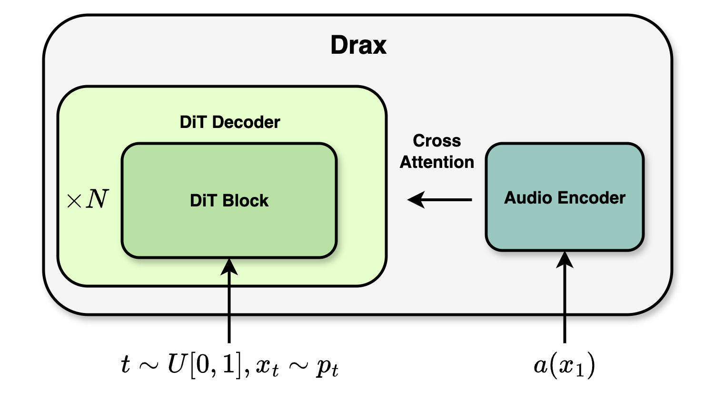

# Drax: Speech Recognition with Discrete Flow Matching

## Introduction

This repository contains the official implementation for **Drax: Speech Recognition with Discrete Flow Matching**.


<div align="center">
  
  
</div>


## Installation

Recommended:

```bash
conda create -n drax python=3.10 -y
conda activate drax
# then install as above
pip install -U pip
pip install torch==2.7.0 torchaudio==2.7.0 --index-url https://download.pytorch.org/whl/cu128
pip install -e .
```

If you don't already have Torch installed, run:

```bash
pip install -e .[with-torch]
```

## Quickstart: Transcribe

```python
from drax import Transcriber

asr = Transcriber(model_path="aiola-labs/drax-v1")  # HF repo or local path
result = asr.transcribe("/path/to/audio.wav", language="en")
print(result[0].transcript)
```

Controlling sampling steps, temperature, etc.
```python
result = asr.transcribe("/path/to/audio.wav", language="en", sampling_steps=32, temperature=1e-2)
print(result[0].transcript)
```

Batch inference
```python
audio_paths = ["/path/to/audio1.wav", "/path/to/audio2.wav"]
languages = ["en", "de"]
result = asr.transcribe(audio_paths, language=languages)
print(result.transcript)
```


## Dependencies

Core deps are installed via `pyproject.toml` (including `transformers==4.52.3`).
Torch/torchaudio are installed via the `[with-torch]` extra or separately for your CUDA.

## Development

Enable pre-commit hooks (Ruff):

```bash
pip install pre-commit ruff
pre-commit install
# Run manually
pre-commit run -a
```

## References

- Drax: Speech Recognition with Discrete Flow Matching: TBD
- Discrete Flow Matching: https://arxiv.org/abs/2407.15595
- Flow Matching with General Discrete Paths: https://arxiv.org/abs/2412.03487
- Generative Flows on Discrete State-Spaces: https://arxiv.org/abs/2402.04997
- Simplified and Generalized Masked Diffusion for Discrete Data: https://arxiv.org/abs/2406.04329


## Acknowledgements

This project borrows components from:
- Flow-matching: https://github.com/facebookresearch/flow_matching
- Flash attention: https://github.com/Dao-AILab/flash-attention
- Discrete Diffusion Modeling by Estimating the Ratios of the Data Distribution: https://github.com/louaaron/Score-Entropy-Discrete-Diffusion
- GLIDE: https://github.com/openai/glide-text2im/

## License

The majority of the code is licensed under CC-BY-NC; portions may be available under separate terms (BSD/MIT) as noted in the referenced projects.

## Citation

TDB
